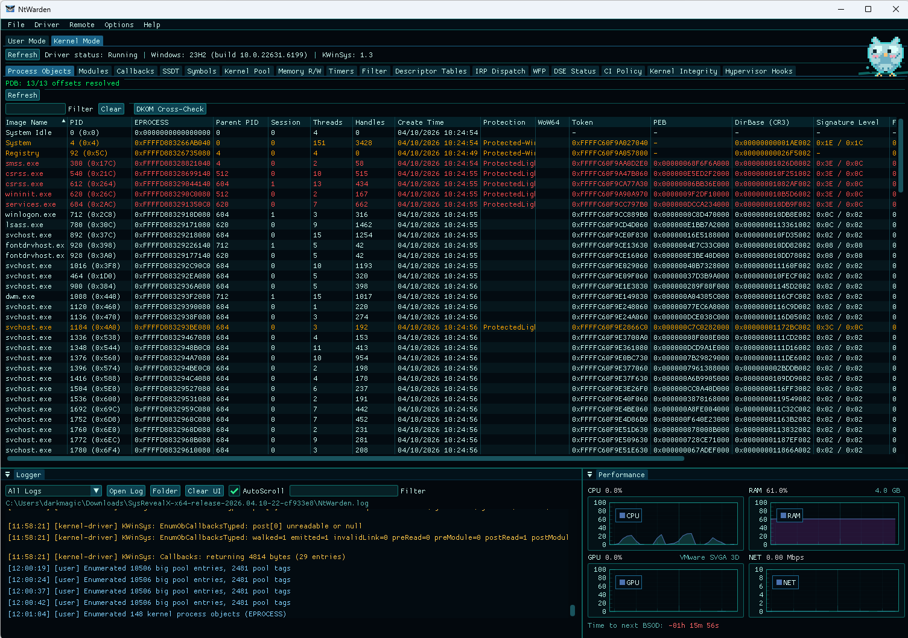
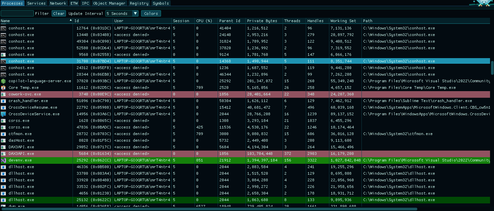
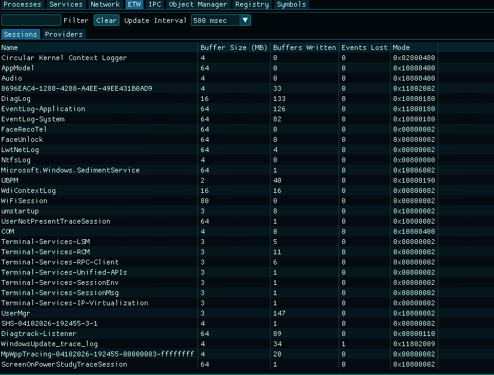
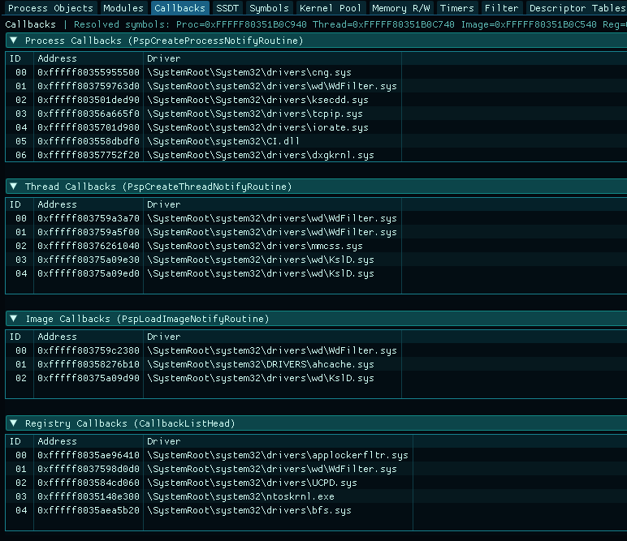
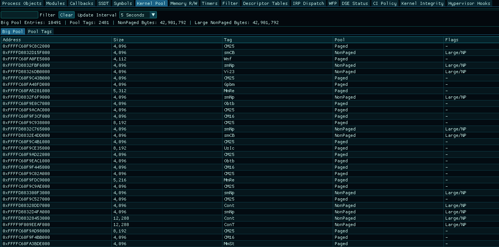
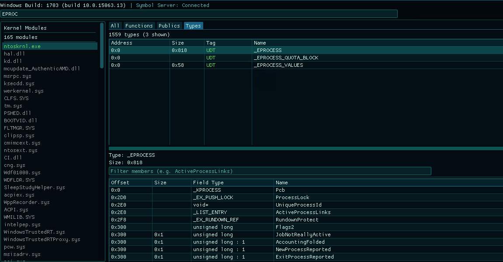
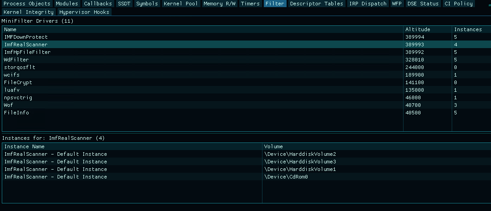

<p align="center">
  
</p>

<h1 align="center">NtWARden</h1>
<h3 align="center"><i>Windows Analysis and Research Toolkit</i></h3>

* Windows system inspection tool built on ImGui + DirectX 11.  
* Covers processes, services, network, kernel internals, and more - locally or over the network via WinSysServer.

> ⚠️ Parts of this project were vibe coded with AI assistance so it might have some bugs. 
 The kernel driver (KWinSys) should only be installed in a Test VM for research purposes. 

## Screenshots

#### Processes (Kernel Mode) 


<table>
  <tr>
    <td align="center"><a href="screenshots/user_processes.png"><br>Processes (User Mode)</a></td>
    <td align="center"><a href="screenshots/user_etw.png"><br>ETW Sessions</a></td>
    <td align="center"><a href="screenshots/callbacks.png"><br>Kernel Callbacks</a></td>
  </tr>
  <tr>
    <td align="center"><a href="screenshots/kernel_pool.png"><br>Kernel Pool</a></td>
    <td align="center"><a href="screenshots/symbol_viewer.png"><br>Symbols</a></td>
    <td align="center"><a href="screenshots/filters.png"><br>Filters</a></td>
  </tr>
</table>


## Architecture

| Component | Role |
|---|---|
| **NtWarden** | GUI app (ImGui + DirectX 11) |
| **WinSys** | Static lib for process, service, and network enumeration |
| **KWinSys** | Kernel driver for callbacks, SSDT, kernel modules, etc. |
| **WinSysServer** | Headless TCP server for remote inspection |

## Features

### User Mode (no driver needed)

| Tab | What it does |
|---|---|
| **Processes** | Process list with tree view, handles, threads, memory regions, modules |
| **Performance** | Real-time CPU, RAM, GPU, and network usage graphs - can be overlaid on top of other tasks |
| **Services** | Service enumeration with status, start type, binary path |
| **Network > Connections** | TCP/UDP connections with owning process and remote endpoints |
| **Network > Root Certificates** | Trusted root CA store with subject, issuer, thumbprint |
| **Network > NDIS** | Network adapter info - driver, MAC, speed, media type |
| **ETW** | Active trace sessions and registered providers |
| **IPC** | RPC endpoints and named pipes |
| **Object Manager** | Browse the kernel object namespace - directories, symlinks, devices |
| **Registry** | Registry browser with key/value enumeration |
| **Symbols** | User-mode symbol loading status |
| **Logger** | Intercepts kernel driver debug logs and user-mode GUI logs in one place |

### Kernel Mode (needs KWinSys)

| Tab | What it does |
|---|---|
| **Process Objects** | EPROCESS enumeration, hidden process detection via cross-referencing |
| **Modules** | Loaded kernel drivers with base, size, path (along with LolDrivers check) |
| **Callbacks** | Kernel callbacks (process/thread/image/registry/object/power) + integrity checks |
| **SSDT** | SSDT entries with owner and hook detection |
| **Symbols** | Kernel symbol resolution and PDB loading |
| **Kernel Pool** | Big pool allocations, pool tag stats |
| **Memory R/W** | Read/write kernel memory by address |
| **Timers** | Per-CPU interrupt and DPC counters |
| **Filter** | Minifilter drivers with altitude and instance info |
| **Descriptor Tables** | GDT/IDT entries |
| **IRP Dispatch** | IRP dispatch table for any driver - handler addresses, owner module |
| **WFP** | WFP callout drivers and filters |
| **DSE Status** | Driver Signature Enforcement state |
| **CI Policy** | Code Integrity policy and enforcement level |
| **Kernel Integrity** | Verify kernel .text against on-disk image |
| **Hypervisor Hooks** | EPT hook detection via timing analysis |

### Analyze Process (right-click > Analyze Process)

Per-process security analysis, accessible from the process context menu.

| Section | What it checks |
|---|---|
| **Unbacked Memory** | Private executable regions not backed by any file (shellcode indicator) |
| **Hollowing** | PEB ImageBase vs PE header ImageBase mismatch |
| **Module Stomping** | In-memory .text sections compared against disk originals |
| **Direct Syscalls** | `syscall` (0F 05) instructions found outside ntdll |
| **Syscall Stubs** | ntdll stub integrity - memory bytes vs clean disk copy |
| **User Hooks** | Inline hooks (JMP/CALL patches) in ntdll, kernel32, etc. (needs capstone to disassemble analyzed bytes)|
| **Tokens** | Elevation, integrity level, impersonation, suspicious privileges |
| **Debug Objects** | Debug objects and debug ports on the process |
| **Hypervisor** | CPUID vendor check + RDTSC/CPUID timing anomalies |
| **Job Objects** | Job membership, limits, UI restrictions |
| **CFG Status** | CFG/XFG enforcement state and mitigation flags |

## Building

**Requirements:** Visual Studio 2022, Windows SDK 10.0.26100.0+, WDK (for KWinSys)

```
NtWarden.sln
├── NtWarden/          # GUI app
├── WinSys/            # Core library (static lib)
├── KWinSys/           # Kernel driver
└── WinSysServer/      # Remote server
```

1. Open `NtWarden.sln` in Visual Studio
2. Build **Release | x64**
3. Output goes to `x64/Release/`

## Driver Setup

KWinSys needs test signing or a valid signature.

```powershell
# Enable test signing (reboot required)
bcdedit /set testsigning on

# On VMs you may also need
bcdedit /set nointegritychecks on
```

Run NtWarden as **Administrator**. Switching to the Kernel Mode tab will auto-install and start the driver if it's not already loaded. You can also manage it manually from the **Driver** menu.

## Remote Inspection

WinSysServer runs on a target machine (usually a VM) and serves system data over TCP. Connect from NtWarden via **Remote > Connect**.

### What to copy to the target

| File | Path | Needed for |
|---|---|---|
| `WinSysServer.exe` | `x64/Release/WinSysServer.exe` | Always |
| `KWinSys.sys` | `x64/Release/KWinSys/KWinSys.sys` | Kernel features only |

> User-mode stuff (processes, services, network) works without the driver. Kernel tabs need KWinSys loaded on the target.

### Running the server

```powershell
# Auto-install driver + start server (run elevated)
WinSysServer.exe --install              # default port 50002
WinSysServer.exe --install --port 9000  # custom port

# Or install the driver yourself first
sc create KWinSys type= kernel binPath= "C:\path\to\KWinSys.sys"
sc start KWinSys
WinSysServer.exe [--port <port>]        # default: 50002
```

### Connecting from NtWarden

1. Launch NtWarden
2. **Remote** > enter target IP and port > **Connect**

### Protocol

Custom binary protocol over TCP. 12-byte header (`MessageType`, `DataSize`, `Status`). No auth - use in isolated lab/VM environments only.

## Tested On
- Windows 11 23H2 (Build 22631.6199)
- Windows 10 22H2 (Build 19045.2006)
- Windows 10 1703 (Build 15063.13)

## Credits

- [zodiacon](https://github.com/zodiacon) - Major inspiration for the project
- [WinArk](https://github.com/BeneficialCode/WinArk) - Reference for kernel-mode features

## License

MIT - see [LICENSE](LICENSE).
